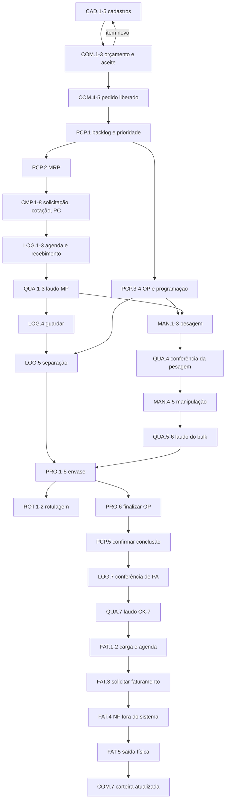

# Fluxos do sistema — modelo operacional por área

Feito a pedido do usuário em 2026-09-23: *"sai daqui, vai para lá, preenche aqui,
aparece ali… numerar [Área].1, [Área].2… linkar um fluxo padrão de ponta a ponta e
prever fluxos não padrões… modelar o sistema pra entender onde temos gaps de
desenvolvimento"*.

Conferido contra o código publicado em `bf0e823` (telas, abas e botões com o nome que
aparece na tela). Complementa o `MAPA_DO_SISTEMA.md` (quem é dono de cada dado) e a
`AUDITORIA_INTEGRACAO.md` (os elos entre setores), e está ligado ao `MELHORIAS_FUTURAS.md`:
cada gap aponta a seção do backlog onde está o detalhe, e a seção *Backlog × fluxo* diz
onde cada item do backlog se encaixa. **Quem mudar um fluxo no código
atualiza o passo aqui no mesmo commit.**

## Como ler

- Cada passo tem um código **`ÁREA.n`**, que é citado no fluxo padrão, nas exceções e
  nos gaps.
- Colunas: **Onde** (tela › aba › botão) · **Faz / preenche** · **Resultado → aparece em**.
- Situação: ✅ funciona · 🟡 funciona em parte · ⬜ não existe (é gap).
- Siglas: `CAD` Cadastro · `CMP` Compras · `COM` Comercial · `PCP` PCP · `LOG` Logística ·
  `QUA` Qualidade · `PRO` Operação › Produção · `MAN` Operação › Manipulação ·
  `ROT` Operação › Rotulagem · `FAT` Faturamento · `EX` exceção · `GAP` gap.

---

## CAD — Cadastro

| Nº | Onde | Faz / preenche | Resultado → aparece em | |
|---|---|---|---|---|
| CAD.1 | Cadastros › Clientes › + Novo Cliente | Razão social, CNPJ, contatos por área (principal de cada área), endereços de entrega e de faturamento, condição de pagamento | Cliente disponível para o orçamento e o pedido (COM.1, COM.4); contato da Logística sugerido na agenda de carga (FAT.2) | ✅ |
| CAD.2 | Cadastros › Fornecedores › + Novo Fornecedor | CNPJ, contato, endereço pelo CEP | Fornecedor disponível para a cotação (CMP.3); endereço vira a origem sugerida da rota do PC (CMP.7) | ✅ |
| CAD.3 | Cadastros › Materiais › + Novo Material | Código, descrição, unidade de estoque, **unidade de compra + fator de conversão**, tipo (MP, embalagem, rótulo), fornecedores homologados | Material aparece no BOM (CAD.5), no MRP (PCP.2), na cotação já na unidade certa (CMP.3) e no recebimento (LOG.3) | ✅ |
| CAD.4 | Cadastros › Produtos (tarefas no topo, ou + Novo Produto) | Identificação (código, descrição, **cliente**), Classificação, Embalagem (**un/caixa, peso/caixa**), Regulatório, Parâmetros de Lote (**validade**) | Salvar fecha a tarefa aberta pelo Comercial (COM.3). SKU passa a ser aceito no pedido (COM.4) | ✅ |
| CAD.5 | Cadastros › Fórmulas / BOM / Especificações | Fórmula do bulk (% por MP), BOM de embalagem (por peça), especificações de produto (ensaio, método, mín/máx, crítico). **+ Nova Versão** e aprovação **P&D + Qualidade** | Só a versão aprovada vale para emitir OP (PCP.3); a especificação vira o formulário do laudo (QUA.3, QUA.5) | ✅ |
| CAD.6 | Qualidade › Especificações | Especificação de **matéria-prima** (a de produto é no CAD.5) | Formulário do laudo de recebimento (QUA.2) | ✅ |

**Saídas da área:** COM.4, PCP.2, PCP.3, CMP.3, QUA.2.
**Falhas conhecidas:** un/caixa e peso/caixa vazios só **avisam** na OP ([GAP-19](#gap-19)); ensaios sem mín/máx numérico deixam o julgamento todo para o analista.

---

## CMP — Compras

| Nº | Onde | Faz / preenche | Resultado → aparece em | |
|---|---|---|---|---|
| CMP.1 | Compras › Solicitações | Chega sozinha pelo PCP.2 (marcada "MRP", com a conta) ou manual em **+ Nova Solicitação** (material, quantidade, data) | Solicitação **PENDENTE** | ✅ |
| CMP.2 | Compras › Solicitações | **Aprovar** ou **Rejeitar** | Aprovada fica disponível para cotar | ✅ |
| CMP.3 | Compras › 🤝 Cotações › Iniciar Cotação e Criar Rascunhos | Junta as solicitações aprovadas. Sugere os homologados do material; **+ Fornecedor** inclui outros (da base ou por CNPJ) e similares por volume (exigem ficha técnica) | Processo de cotação com o selo de qualidade de cada fornecedor (vem do QUA.9) | ✅ |
| CMP.4 | Cotações › 📋 Copiar Texto de Cotação | Texto enviado ao fornecedor **fora do sistema** (e-mail/WhatsApp) | — | 🟡 |
| CMP.5 | Cotações › 1. Preencher proposta | Por fornecedor: preço, quantidade e **unidade cotadas**, conversão, % NF, impostos, frete CIF/FOB, prazos de pagamento e de entrega. **Declinou** para quem não respondeu | Custo por unidade de estoque com impostos e frete | ✅ |
| CMP.6 | Cotações › 2. Comparar propostas › Gerar pedidos por fornecedor | Decide o vencedor de cada material | Um **Pedido de Compra** por fornecedor, ABERTO | ✅ |
| CMP.7 | Compras › Pedidos de Compra › ✏️ Editar | Confirma a **rota** (origem/destino; FOB exige contato e telefone na origem, CIF exige destino) e **🔗 Cliente/pedido** (de quem é o material) | Rota e dono **congelados** no PC. Sem isso o PC não é enviado nem recebido | ✅ |
| CMP.8 | Pedidos de Compra › 🖨 Enviar ao fornecedor · Marcar Enviado | Documento do PC + páginas de etiqueta | PC ENVIADO: aparece em **Logística › A Receber** (LOG.1) e entra no MRP como em trânsito | ✅ |
| CMP.9 | — | Contas a pagar | Parcelas ficam gravadas no PC; **não vão a lugar nenhum** ([GAP-12](#gap-12)) | ⬜ |

**Exceções:** PC direto ([EX-09](#ex-09)), cancelar PC ([EX-10](#ex-10)), remessa do cliente ([EX-11](#ex-11)).

---

## COM — Comercial

| Nº | Onde | Faz / preenche | Resultado → aparece em | |
|---|---|---|---|---|
| COM.1 | Comercial › Orçamentos | Cliente cadastrado **ou prospecto**, itens livres ou cadastrados, preço, condições. **Salvar orçamento** | Orçamento EM_ELABORACAO. **Não chega ao PCP** | ✅ |
| COM.2 | Orçamentos › Imprimir / salvar PDF · Marcar enviado | PDF enviado ao cliente fora do sistema | Orçamento ENVIADO | ✅ |
| COM.3 | Orçamentos › Registrar aceite | Aceite do cliente | ACEITO. Item sem cadastro vira **tarefa em Cadastros › Produtos** (CAD.4) e aparece em **Comercial › Cadastros pendentes** | ✅ |
| COM.4 | Comercial › Pedidos | Cliente (preenche contato, endereços e pagamento, editáveis), SKUs cadastrados, quantidades, preço, % NF, CIF/FOB, previsão de entrega. **Salvar rascunho** | Pedido comercial em rascunho | ✅ |
| COM.5 | Pedidos › Confirmar e liberar ao PCP | — | Cria `pedidos/{PED__SKU}` (uma linha por SKU) → **PCP.1**. Previsão vira `dataEntrega` (o MRP ignora de propósito). E-mail com PDF para a diretoria | ✅ |
| COM.6 | Comercial › Documentos e histórico | **Anexar** (pedido do cliente, aceite, briefing, arte), linha do tempo | Anexos e eventos do pedido | ✅ |
| COM.7 | Gestão Comercial › Carteira / Prazos / Visão geral | Acompanha pedido × produzido × expedido × a entregar | Leitura: vem do PRO.6 e do FAT.5 | ✅ |
| COM.8 | Gestão Comercial › Tabela de preços | Preço por SKU com vigência | Preenche o item sem preço no COM.4 | ✅ |

**Exceções:** orçamento perdido ([EX-01](#ex-01)), ajuste de pedido ([EX-02](#ex-02)), cancelamento ([EX-03](#ex-03)).

---

## PCP — PCP

| Nº | Onde | Faz / preenche | Resultado → aparece em | |
|---|---|---|---|---|
| PCP.1 | Pedidos e MRP › ⚙️ Pedidos — SKUs para Produção · 🔀 Ordenar Prioridades | Recebe o backlog do COM.5 e define a ordem | Prioridade usada na programação (PCP.4) | ✅ |
| PCP.2 | Matriz de Insumos › 🧮 MRP — Necessidade de Materiais › 🛒 Solicitar Compra | Confere as faltas (necessário − disponível − em trânsito), justifica e envia | Solicitação PENDENTE em **CMP.1** | 🟡 lead time/lote mínimo vazios ([GAP-06](#gap-06)); saldo não confiável ([GAP-01](#gap-01)) |
| PCP.3 | Emitir OP | Escolhe pedido/SKU e quantidade; o sistema traz fórmula e BOM da versão aprovada e o saldo; **Substituir** material se faltar. **Emitir OP** · 🖨 documento · 🏷️ etiquetas de caixa | OP (= lote) **Programado**, com empenho. Aparece no **Controle de OPs**, na **Separação** (LOG.5), na **Manipulação** (MAN.1) e no **Planejamento** | ✅ |
| PCP.4 | Planejamento › 📦 Planejamento de OPs / 📋 Agendamento › 📅 Programar | Linha, dia e horário | OP na grade: aparece para o apontador no painel do turno (PRO.2) | 🟡 OP sem bloco fica sem data ([GAP-07](#gap-07)); auto-ajuste pausado |
| PCP.5 | Controle de OPs (filtro "Aguardando Confirmação") › ✅ Confirmar conclusão | Confere o total apontado no PRO.6 | OP **Concluído**: libera a **Conferência de PA** (LOG.7) e devolve o empenho que sobrou | ✅ |
| PCP.6 | Histórico · Dashboards | Revisa apontamentos (só PCP/admin editam) | Ritmo real, paradas e perdas para o próximo planejamento | ✅ · ⬜ "visto do PCP" ([GAP-15](#gap-15)) |

**Exceções:** falta na emissão ([EX-05](#ex-05)), transferir OP ([EX-04](#ex-04)), cancelar OP ([EX-06](#ex-06)), rearranjo/urgência ([EX-15](#ex-15)), retrabalho ([EX-19](#ex-19)).

---

## LOG — Logística

| Nº | Onde | Faz / preenche | Resultado → aparece em | |
|---|---|---|---|---|
| LOG.1 | Logística › A Receber › 📅 Agendar › Salvar Agendamento | Data (vem da previsão do PC); FOB: transportadora, valor, referência; confere a **rota congelada** (copiar / abrir no mapa) | Agendamento no **Calendário** | ✅ |
| LOG.2 | A Receber › 🏷️ Checklist de Etiqueta | Confere a identificação da carga contra o padrão enviado no CMP.8 | Checklist registrado | ✅ |
| LOG.3 | A Receber › 📦 Registrar recebimento › Confirmar Recebimento | Ficha de entrada (14 perguntas): quantidade e volumes (**+ Outro lote deste material**), lote do fornecedor, **validade**, amostragem, certificado, notas do veículo e da embalagem, endereço (padrão: Doca) | Lote interno **AK-AAAA-NNNNNN**, saldo, lote em **QUARENTENA** → **QUA.1**; PC muda para recebido parcial/total; etiquetas | ✅ |
| LOG.4 | Estoque › 📍 Endereçamento › Na Doca › 📍 Guardar (ou Saldo por Lote › Transferir) | Escolhe a posição no mapa | Lote no endereço definitivo; a Qualidade não precisa mover nada | ✅ · ⬜ pendências de guarda por setor ([GAP-16](#gap-16)) |
| LOG.5 | Separação de Materiais › 📦 Separar › ✅ Confirmar Separação | OP da fila (vem do PCP.3); lote sugerido por **FEFO** (só LIBERADO); **destino manual** (RÓTULOS, FÁBRICA…) | Lotes movidos para a área da produção. **Não baixa saldo** (a baixa é no PRO.6) | ✅ · 🟡 falta não sobe ([GAP-08](#gap-08)) |
| LOG.6 | Estoque › 📋 Inventário Rotativo · Saldo Agregado › ⚖️ Ajustar | Contagem cega; ajuste com motivo | Saldo corrigido, movimento auditável | ✅ |
| LOG.7 | Estoque › 📦 Conferência de PA | OP do PRO.6 aparece como **Aguardando PCP** (cobrança); depois do PCP.5: **+ Adicionar palete** (caixas fechadas, un/caixa, parcial, endereço) › **Confirmar contagem** | Palete de PA em **QUARENTENA** → **QUA.7** | ✅ |
| LOG.8 | Descarte › Segregar e solicitar › Confirmar saída | Vencido, reprovado ou retido | Baixa só na coleta/destinação; entra na conciliação do pedido | ✅ |

---

## QUA — Qualidade

| Nº | Onde | Faz / preenche | Resultado → aparece em | |
|---|---|---|---|---|
| QUA.1 | Qualidade › 🔬 Fila de Inspeção › ▶ Assumir | Tudo em quarentena chega sozinho (LOG.3, MAN.6, LOG.7) | Item em análise, com dono | ✅ |
| QUA.2 | Fila › 🔬 Laudar (MP / embalagem) | A ficha de entrada do LOG.3 vem preenchida e travada; o analista registra integridade e ensaios pela especificação (CAD.6) | Ensaio dentro/fora da faixa na hora | ✅ |
| QUA.3 | Laudo › Liberar para uso · Aprovar c/ concessão · ⏸ Reter · Reprovar · 🖨 Emitir laudo | Decisão; reprovar e reter exigem motivo; concessão exige quem autorizou | LIBERADO: lote visível na **Separação** (LOG.5) e na **pesagem** (MAN.2). REPROVADO: **RNC automática** (QUA.8) + selo do fornecedor (CMP.3) | ✅ |
| QUA.4 | Manipulação › Conferência (chave ligada) | ✓ Confere / ✕ Diverge por MP, com login | Pesagem conferida → MAN.4 | ✅ |
| QUA.5 | Fila › 🧪 Analisar granel | Ensaios do bulk (CAD.5) | — | ✅ |
| QUA.6 | Granel › Liberar para envase · Reprovar granel | Decisão | Liberado: a OP pode envasar (PRO.3). Reprovado: envase bloqueado + RNC | 🟡 brecha ([GAP-04](#gap-04)) |
| QUA.7 | Fila › 🔬 Laudar (palete de PA) | Inspeção CK-7: peso pelo INMETRO (x̄ ≥ Qn − k·s), embalagem, ensaios | Palete LIBERADO: disponível para a **carga** (FAT.1) | ✅ |
| QUA.8 | ⚠️ Não Conformidades · + Nova RNC · ▶ Assumir · ✓ Encerrar | Automática (QUA.3, QUA.6, LOG.7) ou manual; encerrar exige causa raiz, ação e disposição | Disposição (devolver, descartar, retrabalhar, concessão) **não dispara a ação** ([GAP-10](#gap-10)) | 🟡 |
| QUA.9 | 🏭 Desempenho de Fornecedor | — | Selo na cotação (CMP.3) | ✅ |

---

## PRO — Operação › Produção (envase)

| Nº | Onde | Faz / preenche | Resultado → aparece em | |
|---|---|---|---|---|
| PRO.1 | Operação › Produção › ▶️ Iniciar turno · + Abrir posto de trabalho | Turno, linhas e postos ativos, pessoas | Linhas no painel ANDON e nos dashboards | ✅ |
| PRO.2 | Linha › + Alocar OP › ▶️ Abrir OP | OP programada (PCP.4); o material chegou pelo LOG.5 | OP em setup; linha ocupada | ✅ |
| PRO.3 | Fim de Setup → iniciar envase | — | Início do envase registrado (tempo de setup medido). Bloqueia se o bulk da OP foi reprovado ou está pendente (ver [GAP-04](#gap-04)) | 🟡 |
| PRO.4 | Durante o turno: checkpoint (total acumulado), **+ Adicionar parada**, **+ Adicionar perda**, ⇄ Mudar de linha / trocar OPs | Total acumulado; motivo/duração da parada; material/quantidade da perda | Incremento gravado; a perda baixa o material | ✅ |
| PRO.5 | Encerrar e Salvar (fim de turno) | Total até ali | OP pausada, pronta para continuar no dia seguinte | ✅ |
| PRO.6 | 🏁 Finalizar OP (Fechar esta OP →) | Total final e perdas | Quantidade + **baixa do BOM/fórmula** + **crédito no pedido** numa só gravação. OP em **Aguardando Confirmação** → **PCP.5** e **LOG.7** | ✅ |
| PRO.7 | Posto › + Somar produção | Execução de OP de retrabalho no posto | Crédito na OP de retrabalho (não no pedido) | ✅ |

---

## MAN — Operação › Manipulação

| Nº | Onde | Faz / preenche | Resultado → aparece em | |
|---|---|---|---|---|
| MAN.1 | Operação › Manipulação | Lista das OPs emitidas (PCP.3) com a fórmula aprovada | — | ✅ |
| MAN.2 | OP › Iniciar pesagem | Por MP: lote sugerido por **FEFO**, pesa e vai para a **Próxima MP ›**; **Usar outro lote** / **Guardei em outro lugar** | Pesagem por lote de MP | 🟡 FEFO depende do estoque ([GAP-01](#gap-01)) |
| MAN.3 | Fechar pesagem e baixar estoque | — | Baixa dos lotes de MP; e-mail de pesagem fechada; vai para a conferência (QUA.4) se a chave estiver ligada | ✅ |
| MAN.4 | Iniciar manipulação | Depois da conferência (ou **Liberar sem conferência (admin)**, com motivo) | Manipulação em andamento | ✅ |
| MAN.5 | Fechar e enviar para a Qualidade | Rendimento | Bulk na fila **QUA.5** | ✅ |
| MAN.6 | Estoque do setor | Consulta da MP da manipulação | — | ✅ · ⬜ bulk em tanque ([GAP-17](#gap-17)) |

---

## ROT — Operação › Rotulagem

| Nº | Onde | Faz / preenche | Resultado → aparece em | |
|---|---|---|---|---|
| ROT.1 | Operação › Rotulagem (mesma tela da Produção, seção Rotulagem) › + Alocar OP › Abrir OP | A mesma OP pode rodar **ao mesmo tempo** no envase e na rotulagem | Estação ocupada, setup próprio | ✅ |
| ROT.2 | Apontamento / Encerrar | Total rotulado, perdas | Soma em `produzidoRotulagem`, **separada**; **não credita o pedido** | 🟡 ([GAP-09](#gap-09)) |
| ROT.3 | Estoque do setor (sala de rótulos) | Consulta dos rótulos | — | ✅ · ⬜ guarda dos rótulos liberados ([GAP-16](#gap-16)) |
| ROT.4 | — | Ordem de rotulagem própria e "pronto = menor quantidade entre etapas" | **Não existe** | ⬜ ([GAP-09](#gap-09)) |

---

## FAT — Faturamento / Expedição

| Nº | Onde | Faz / preenche | Resultado → aparece em | |
|---|---|---|---|---|
| FAT.1 | Expedição › grade de paletes › Montar carga | Só paletes **conferidos, liberados (QUA.7) e endereçados**, do mesmo cliente e destino | Carga com pedido, OP, lote e laudo herdados | ✅ |
| FAT.2 | Agendar carga | Data, horário, transportadora, motorista, placa, contato do cliente (sugerido do CAD.1) | Agenda em **Logística › Saídas de PA**; **não baixa estoque**; palete reservado | ✅ |
| FAT.3 | Saídas de PA › Solicitar faturamento | Observações para o Financeiro | E-mail + PDF para o Financeiro (cópia para a diretoria); status **Solicitado ao Financeiro** | ✅ |
| FAT.4 | **Fora do sistema** | Financeiro emite a NF | — | ⬜ ([GAP-11](#gap-11)) |
| FAT.5 | Expedição › Saída e nota fiscal › Confirmar saída física | Data, **NF, série, chave, valor** | Baixa dos paletes + **expedido** nos pedidos (COM.7) numa só gravação | ✅ |
| FAT.6 | Gestão Comercial › Faturamento · Relatório de Expedição | Acompanhamento | — | ✅ · ⬜ contas a receber ([GAP-12](#gap-12)) |

---

## Fluxo padrão ponta a ponta

Em sequência, com o que passa de mão em mão:

1. **Nasce a venda.** CAD.1 → COM.1 → COM.2 → COM.3 (item novo → CAD.4 → CAD.5) → COM.4 → COM.5.
   *Passa adiante:* linhas `pedidos/{PED__SKU}`.
2. **Planeja.** PCP.1 → PCP.2 (falta → CMP.1) → PCP.3 → PCP.4.
   *Passa adiante:* OP com empenho, na grade.
3. **Compra e recebe.** CMP.1 → CMP.2 → CMP.3 → CMP.5 → CMP.6 → CMP.7 → CMP.8 → LOG.1 → LOG.2 → LOG.3.
   *Passa adiante:* lote AK em quarentena.
4. **Libera o material.** QUA.1 → QUA.2 → QUA.3 → LOG.4.
   *Passa adiante:* lote LIBERADO, visível para separar e pesar.
5. **Prepara o bulk.** MAN.1 → MAN.2 → MAN.3 → QUA.4 → MAN.4 → MAN.5 → QUA.5 → QUA.6.
   *Passa adiante:* bulk liberado para envase.
6. **Separa e envasa.** LOG.5 → PRO.1 → PRO.2 → PRO.3 → PRO.4 → (PRO.5 a cada fim de turno) → ROT.1 → ROT.2 → PRO.6.
   *Passa adiante:* OP aguardando confirmação, baixa do BOM, crédito no pedido.
7. **Fecha a OP e confere o PA.** PCP.5 → LOG.7 → QUA.1 → QUA.7.
   *Passa adiante:* palete LIBERADO.
8. **Expede e fatura.** FAT.1 → FAT.2 → FAT.3 → FAT.4 → FAT.5 → COM.7.
   *Fecha:* produzido = expedido + em estoque.

---

## Fluxos não padrão

| Nº | Situação | Caminho no sistema hoje | |
|---|---|---|---|
| EX-01 | **Orçamento perdido / recusado / vencido** | Não há status para isso: o orçamento fica ENVIADO para sempre; não há motivo de perda nem taxa de conversão | ⬜ [GAP-13](#gap-13) |
| EX-02 | **Ajuste de pedido** (quantidade, SKU, data, condição) | Gestão Comercial › Carteira › Editar pedido › Salvar nova versão: grava versão com motivo e o antes/depois, atualiza `pedidos_comerciais` **e** `pedidos`. Trava: quantidade ≥ produzido e ≥ expedido; item com OP, produção ou saída não é removido. **Reduzir abaixo da quantidade da OP já emitida não avisa o PCP nem ajusta a OP/empenho**; aumento aparece só como saldo no backlog (PCP.1). "Registrar aditivo" (COM.6) só anota texto e versão, não muda quantidade | 🟡 [GAP-05](#gap-05) |
| EX-03 | **Cancelamento do pedido pelo cliente** | Comercial › Documentos › Cancelar saldo (motivo): pedido CANCELADO, linhas `pedidos` encerradas, produção preservada. **OPs abertas continuam Programadas**, com empenho e na grade; PCs e remessas ligados ao pedido não são avisados; PA já produzido fica no estoque sem destino | 🟡 [GAP-05](#gap-05) |
| EX-04 | **OP no pedido errado** | Controle de OPs › ✏️ transferir: move o vínculo, o produzido, paletes com saldo, programação futura e alocação; paletes já expedidos ficam no pedido antigo; retomada idempotente | ✅ |
| EX-05 | **Falta de material na emissão da OP** | Emitir OP › Substituir › Confirmar troca de material (fica registrado na OP). Sem substituto: emitir mesmo assim e comprar (PCP.2) | ✅ |
| EX-06 | **Cancelar OP** | Controle de OPs › 🚫 → alerta se houver apontamento → Cancelar OP mesmo assim: libera o empenho e a alocação | ✅ |
| EX-07 | **Falta na separação** | LOG.5 avisa na tela e deixa separar o que tem; **o aviso não chega ao PCP nem à linha** | ⬜ [GAP-08](#gap-08) |
| EX-08 | **Recebimento errado** | Antes de análise ou movimento: Logística › Histórico › Cancelar recebimento (estorna saldo; o AK fica no histórico). Parcial: recebe o que veio, o PC fica recebido parcial | ✅ |
| EX-09 | **Material chegou sem PC** | Compras › ⚡ PC Direto › Criar e liberar pra recebimento (marcado como fora do processo) → LOG.3 | ✅ |
| EX-10 | **PC precisa mudar depois de enviado** | ✖ Cancelar (admin, motivo) → oferece devolver a solicitação para Aprovada → nova cotação/PC. Parcial: cancela só o saldo | ✅ |
| EX-11 | **Remessa de insumo do cliente** | PC de remessa (propriedade do cliente) → LOG.3 → estoque `porCliente`; só é consumido nas OPs daquele cliente | ✅ |
| EX-12 | **MP reprovada → devolução ao fornecedor** | QUA.3 Reprovar → RNC automática + selo → Logística › Histórico › **Devolver**: sai do estoque e reabre o saldo do PC. **Compras não é avisado**; não há documento/NF de devolução nem crédito com o fornecedor | 🟡 [GAP-10](#gap-10) |
| EX-13 | **Aprovação com concessão** | QUA.3 Aprovar c/ concessão (nome de quem autorizou) → lote utilizável; não conta como aprovação no selo | ✅ |
| EX-14 | **Pesagem divergente** | QUA.4 ✕ Diverge → bloqueia a manipulação → repesar ou Liberar sem conferência (admin, motivo) | ✅ |
| EX-15 | **Urgência / troca de linha / linha parada** | PCP.1 reordena → PCP.4 reprograma à mão (auto-ajuste pausado) → PRO.4 ⇄ Mudar de linha / rearranjo (admin) de OPs pausadas, com histórico | 🟡 |
| EX-16 | **Bulk reprovado** | QUA.6 Reprovar granel → RNC, envase bloqueado. **Não há caminho para reprocessar/corrigir, nem descartar o bulk** (ele não é um lote de estoque) e a OP fica travada | ⬜ [GAP-04](#gap-04) |
| EX-17 | **Divergência na Conferência de PA** | LOG.7: 3 contagens, consenso de 2 das 3 últimas → causa e explicação → RNC automática → palete entra com o físico | ✅ |
| EX-18 | **PA reprovado / retido** | QUA.7 Reprovar/Reter → RNC → decisão fora do sistema: retrabalho (EX-19), descarte (LOG.8) ou concessão | 🟡 [GAP-10](#gap-10) |
| EX-19 | **Retrabalho** | Controle de OPs (filtrar Concluído) › ♻️ Abrir OP de retrabalho → OP `{lote}-RT{n}` sem crédito ao pedido e sem baixa de BOM → PRO.2/ROT.1/PRO.7 em linha, rotulagem ou posto → novo laudo QUA.7. **Não nasce da RNC**; material consumido no retrabalho (rótulo, tampa) não tem lançamento próprio; o caso TAWUS ainda não foi migrado (`scripts/migrar-retrabalho-para-op.js`) | 🟡 [GAP-10](#gap-10) |
| EX-20 | **Devolução do cliente** | **Não existe tela.** A conciliação já considera devolução como "volta ao estoque", mas nada registra a entrada, a inspeção nem o estorno no pedido | ⬜ [GAP-02](#gap-02) |
| EX-21 | **NF cancelada / carga não saiu depois de confirmada** | **Não há estorno** da saída física (FAT.5). Antes de confirmar: cancelar a agenda com motivo (não mexe no estoque) e montar outra | ⬜ [GAP-03](#gap-03) |
| EX-22 | **Carga parcial / reagendamento** | FAT.2 com parte dos paletes; o saldo segue reservado para a próxima viagem; cancelar a agenda com motivo e remontar | ✅ |
| EX-23 | **Reclamação de cliente** | QUA.8 + Nova RNC manual. Não há origem "cliente" ligada a pedido/NF/lote nem retorno ao Comercial | 🟡 [GAP-02](#gap-02) |
| EX-24 | **Lote vencido / vencendo** | Estoque › Lotes Vencendo → LOG.8 Descarte | ✅ |
| EX-25 | **Mudança de fórmula/BOM com OPs abertas** | CAD.5 + Nova Versão → a OP emitida mantém a versão que usou; as próximas usam a nova | ✅ |
| EX-26 | **Faturamento por acúmulo** (ex.: coleta a cada 3.000 kg) | Não existe gatilho; feito de cabeça sobre a grade da Expedição | ⬜ [GAP-14](#gap-14) |
| EX-27 | **Inventário divergente** | LOG.6 contagem cega → ⚖️ Ajustar com motivo | ✅ |
| EX-28 | **Pedido lançado fora do Comercial** | Pedidos e MRP › + Novo Pedido ainda cria pedido **sem passar pelo Comercial** (sem preço, versão nem trava) | 🟡 [GAP-18](#gap-18) |
| EX-29 | **Material errado adaptado na produção** (ex.: cortar válvula de 120 mm para 100 mm) | Feito no chão **sem registro nenhum**: não há ordem de transformação, e o tempo e o custo somem na eficiência da linha | ⬜ [GAP-21](#gap-21) |
| EX-30 | **Devolver ao cliente a sobra da remessa dele** | Não há saída "devolução ao cliente" que baixe `porCliente`; hoje se corrige com Estoque › ⚖️ Ajustar escolhendo o cliente | ⬜ [GAP-22](#gap-22) |
| EX-31 | **Sobra da pesagem volta ao endereço de origem** | A Separação guarda de onde o material saiu, mas MAN.3 não oferece o "Devolvido": a sobra fica para sempre no endereço da área de pesagem | ⬜ [GAP-23](#gap-23) |
| EX-32 | **Ajuste do bulk depois de fechado** (MP adicional para corrigir pH, viscosidade…) | Não há fluxo: a MP do ajuste não é solicitada, baixada nem rastreada por lote. Pedido da Qualidade: "não pode usar MP que não esteja na composição" | ⬜ [GAP-04](#gap-04) |

---

## Gaps de desenvolvimento

Ordenados pelo que custa hoje na operação. "Tipo" separa o que é **código** do que é
**operação** (dado a preencher, papel a atribuir), que não se resolve programando.
A coluna **Backlog** aponta a seção do `MELHORIAS_FUTURAS.md` (ou outro plano) onde o
detalhe de implementação mora. **"novo"** = o gap apareceu nesta modelagem e foi
registrado no backlog em 23/09, na seção *Gaps levantados na modelagem de fluxos*.

| Nº | Gap | Passos afetados | Custa hoje | Tipo | Backlog | Prioridade |
|---|---|---|---|---|---|---|
| GAP-01 | Saldo de estoque sem base (só 37 de 906 materiais têm saldo; 11 negativos). Inclui: empenho sem dono, remessa a caminho sem data no MRP, material de cliente parado sem alerta | PCP.2, PCP.3, MAN.2, LOG.5 | MRP, empenho e FEFO calculam sobre números falsos | Operação ("Dia D") | Integração entre setores · Propriedade do estoque · Operação Fase 2 (FEFO) | 🔴 |
| GAP-02 | Não existe **devolução/reclamação de cliente** (entrada, inspeção, estorno no pedido, RNC de origem cliente) | EX-20, EX-23, COM.7 | Produzido ≠ expedido + estoque sem explicação; pós-venda fora do sistema | Código | novo | 🔴 |
| GAP-03 | Não há **estorno da saída física** (NF cancelada, carga que voltou) | FAT.5, EX-21 | Correção só manual no banco | Código | novo (a API de NF prevê "cancelamento fiscal", não o físico) | 🟠 |
| GAP-04 | **Portão do bulk incompleto**: OP recém-emitida vai ao envase sem laudo; bulk reprovado não tem destino; ajuste pós-fechamento sem fluxo; bulk sem endereço/saldo | QUA.6, PRO.3, EX-16, EX-32 | Risco regulatório (Anvisa) e OP travada | Código | novo (portão) · Qualidade › revisão da spec (ajuste de granel, WMS de semi-acabado) | 🔴 |
| GAP-05 | **Mudança no pedido não chega à OP**: reduzir ou cancelar não avisa o PCP, não cancela OP/empenho, não avisa compras/remessas | EX-02, EX-03, PCP.3 | Produz o que o cliente não quer mais; empenho preso | Código | novo | 🔴 |
| GAP-06 | MRP incompleto: parâmetros vazios (lead time, segurança, lote mínimo/múltiplo); necessidade gravada ainda é a bruta; data de demanda = entrega − lead time de produção | PCP.2 | Plano manda comprar tudo "para ontem" | Operação + código | MRP — o que falta · MRP: promessa de entrega | 🟠 |
| GAP-07 | **Planejamento sem vínculo confiável OP↔data↔linha**: OP sem bloco nasce sem data; OP arrastada não sincroniza com a grade de quantidades; "Alocar OP" não trava na OP programada; zona fixa desligada | PCP.3, PCP.4, PRO.2 | MRP e prazo cegos para parte da carteira; linha pode rodar OP fora do plano | Código | `PLANO_PLANEJAMENTO_PCP.md` · Planejamento / PCP | 🟠 |
| GAP-08 | Falta na separação não sobe ao PCP nem à linha; separação sem conferente; uma OP por vez | LOG.5, EX-07 | Linha para sem aviso; viagem ao galpão por OP | Código | `AUDITORIA_INTEGRACAO.md` elo 8 · WMS (onda, duplo-check) | 🟠 |
| GAP-09 | **Rotulagem sem ordem própria**; produção da rotulagem não conta; não há "pronto = menor entre etapas"; celofane pendurado no envase; perda por etapa não medida | ROT.2, ROT.4, PRO.6 | Pedido parece pronto com parte não rotulada | Código | Ordens de Serviço / Roteiro · Estoque / Produção (perda por etapa) | 🟠 |
| GAP-10 | **Disposição da RNC não vira ação**: devolver, descartar e retrabalhar são feitos à mão em outra tela; retrabalho não nasce da RNC nem lança o material consumido; Compras não é avisado da devolução; caso TAWUS não migrado | QUA.8, EX-12, EX-18, EX-19 | Casos parados; custo da não qualidade invisível | Código | Gestão de Retrabalhos · `PLANO_GESTAO_RETRABALHOS.md` | 🟠 |
| GAP-11 | NF emitida fora (sem integração com o emissor) | FAT.4 | Redigitação; nº da NF pode faltar | Código (API) | Outros achados › API de emissão de NF | 🟡 |
| GAP-12 | Não há **contas a pagar / a receber** (parcelas do PC e da venda não vão a lugar nenhum) | CMP.9, FAT.6 | Financeiro trabalha em paralelo | Decisão: integrar, não construir | `PLANO_CUSTOS.md` · Outros achados › gatilho de Financeiro | 🟡 |
| GAP-13 | Orçamento sem status de perdido/recusado/vencido | EX-01 | Sem funil nem taxa de conversão | Código (pequeno) | novo | 🟡 |
| GAP-14 | Faturamento parcial por acúmulo sem gatilho | EX-26 | Coleta decidida de cabeça | Código | Ordens de Serviço › faturamento por acúmulo | 🟡 |
| GAP-15 | "Visto do PCP" nos apontamentos | PCP.6 | PCP não sabe o que já revisou | Código | Operação Fase 2 | 🟡 |
| GAP-16 | Pendências de guarda por setor (MP → Manipulação, rótulos → Rotulagem) e "Guardar / Mover" no setor; quarentena sem endereço bloqueado | LOG.4, MAN.6, ROT.3 | Material liberado esquecido na doca | Código + cadastro | Operação Fase 2 · WMS (quarentena com endereço) | 🟡 |
| GAP-17 | Bulk em tanque com endereço + OP de higienização | MAN.6, PRO.3 | Não se sabe onde está o bulk | Código (Fase 3) | Operação Fase 3 | 🟡 |
| GAP-18 | Duas portas para criar pedido (Comercial e Pedidos e MRP); número do pedido do cliente não aparece no PCP | EX-28, COM.4, PCP.1 | Pedido sem preço, versão nem trava; conciliação com cliente trava | Código (pequeno) | novo · Pedidos — clareza da tela | 🟡 |
| GAP-19 | Cadastro incompleto só **avisa**: un/caixa, peso/caixa, validade; nova versão de fórmula nasce com especificação **vazia**; 74% dos ensaios sem faixa numérica e só 3 críticos | CAD.4, CAD.5, PCP.3, QUA.5, FAT.1 | Carga, NF e FEFO do PA errados; lote vai à linha sem parâmetro | Código (pequeno) + operação | Fórmulas / BOM / Especificações · Qualidade › itens avulsos | 🟡 |
| GAP-20 | Cotação enviada e respondida fora do sistema (texto copiado; proposta sem anexo); NCM ausente, alíquota digitada de cabeça | CMP.4, CMP.5 | Sem registro de envio/resposta; fornecedor pode ganhar por imposto errado | Código | Compras (anexo da proposta, NCM) | 🟡 |
| GAP-21 | **Ordem de transformação** de material (material errado adaptado para o certo) | EX-29, PRO.4 | Tempo e custo invisíveis; eficiência contaminada | Código | Ordens de Serviço › acessórias/de transformação | 🟡 |
| GAP-22 | Devolução de material de remessa ao cliente | EX-30, LOG.8 | Estoque do cliente corrigido por ajuste manual | Código | Propriedade do estoque › saída manual de lote de cliente | 🟡 |
| GAP-23 | Sobra da pesagem sem volta ao endereço | EX-31, MAN.3, LOG.5 | Saldo "preso" na área de pesagem | Código | WMS › devolução da sobra (aguarda decisão) | 🟡 |
| GAP-24 | **Inspeção em linha não existe**: setup/first article (CK-5, 32 un), ronda (CK-6, 1 h), assépsia (CK-3/4), higiene e calibração (CK-8); não há Tarefas Pendentes com SLA | PRO.2, PRO.3, PRO.4, MAN.4 | Desvio de peso/vedação só aparece no laudo do palete | Código | Qualidade › revisão da spec · inventário contra a spec | 🟠 |
| GAP-25 | **Documentação da Qualidade**: RA sem número próprio, retenção (RET) fora do sistema, laudo não arquivado no lote, calibração e COA inexistentes, `gerar_relatorio.py` em paralelo | QUA.3, QUA.7, FAT.1 | Planilhas paralelas; dossiê do lote incompleto para auditoria | Código | Qualidade › laudos do CQ · inventário contra a spec | 🟡 |
| GAP-26 | Sem leitura de código de barras / QR (coletor): endereço, lote na pesagem, contagem | LOG.3–LOG.7, MAN.2 | Tudo digitado, maior fonte de erro do WMS | Código | WMS › leitura de código de barras · lote por QR na pesagem | 🟡 |
| GAP-27 | Alteração de cadastro de produto sem histórico (quem inativou, quem mudou) | CAD.4 | SKU inativado com pedido aberto sem autor | Código (pequeno) | Produtos / SKU › histórico de alterações | 🟡 |
| GAP-28 | Rastreabilidade ponta a ponta incompleta: dossiê do lote sem separação, expedição e OPs derivadas | QUA, FAT.5, EX-04, EX-19 | Recall/auditoria exige juntar telas | Código | Operação › consolidação completa da OP | ⚪ |

### Fora do fluxo, mas com prazo

- **Migrar as Cloud Functions de Node.js 20 antes de 30/10/2026.** Não é um passo de
  fluxo, mas se o runtime for desativado param todas as callables (Conferência de PA,
  Expedição, faturamento, e-mails) — ou seja, FAT, LOG.7 e CMP de uma vez.
  Backlog: *Outros achados › Migrar Cloud Functions*. Faltam ~5 semanas.

---

## Backlog × fluxo

Como cada seção do `MELHORIAS_FUTURAS.md` se encaixa neste modelo. **Dívida técnica** =
não muda nenhum passo do fluxo (qualidade de código, acessibilidade, segurança); entra
no planejamento por risco, não por fluxo. **Feito** = o item já foi entregue e foi
marcado no backlog em 23/09.

| Seção do backlog | Encaixe no fluxo |
|---|---|
| Integração entre setores | Selo na cotação e solicitação pelo MRP: **feito** (CMP.3, PCP.2). Área de quarentena → GAP-16. Saldo → GAP-01 |
| Compras | NCM e anexo da proposta → GAP-20. Etiqueta (arquivo por item, térmica, lista duplicada) → melhoria do CMP.8. Categoria/busca de MU → melhoria do CAD.2. Race do recebimento em `insumos.html` e PDF do PC → dívida técnica |
| Materiais / Cadastros | Rename de código, log de alterações, categoria de uso de MU → melhorias do CAD.3 |
| Produtos / SKU | Histórico de alterações → GAP-27. Cópia órfã, resolver de SKU, 95 códigos antigos, 2 sem cadastro → dívida técnica / dado |
| Pedidos — clareza da tela | Nº do pedido do cliente e SKU nas tabelas → GAP-18 (PCP.1) |
| Fórmulas / BOM / Especificações | Especificação vazia em versão nova, ensaio crítico na ficha, 78 especificações e 531 itens a revisar → GAP-19 |
| Fórmulas — UX | Melhorias do CAD.5 |
| Planejamento / PCP | Sincronização OP arrastada × grade, trava do Alocar OP, zona fixa → GAP-07. Alertas sonoros, e-mail de turno, mensagens do Encerrar OP, operador obrigatório → melhorias do PRO.6/PCP.6. `saveConfig`, dia útil duplicado, listas mortas, cores → dívida técnica. Fichas na pasta de rede, etiqueta maior, DUM14 → melhorias do PCP.3 |
| Acessibilidade · Limpeza de código · Segurança | Dívida técnica (a de segurança pesa mais: leitura aberta a qualquer logado) |
| Ordens de Serviço / Roteiro / Estoque de PA | Ordens principais e roteiro por SKU → GAP-09. Transformação → GAP-21. Faturamento por acúmulo → GAP-14. Estoque de PA incremental: base **feita** (LOG.7 + WMS), o gate "menor entre etapas" segue em GAP-09 |
| Estoque / Produção | Estoque de PA e devolução ao fornecedor: **feitos** (LOG.7, EX-12). Perda por etapa → GAP-09 |
| WMS — lacunas | Coletor e QR na pesagem → GAP-26. Sobra da pesagem → GAP-23. Onda e duplo-check → GAP-08. Quarentena com endereço → GAP-16. Picking × pulmão, capacidade, reabastecimento, contagem por papel → melhorias do LOG.4/LOG.6. `opcoesEnderecoSelect` triplicado → dívida técnica |
| MRP — o que falta | Em trânsito e campo de estoque de segurança: **feitos** (PCP.2). Necessidade líquida gravada e empenho na decisão → GAP-06 |
| Propriedade do estoque | Devolução ao cliente → GAP-22. Remessa sem data, empenho sem dono, material parado → GAP-01. PCs sem 🔗 Cliente/pedido → dado de operação |
| Organização / navegação | `horizonte.html` no limbo → GAP-07. Categoria de produto em texto livre → GAP-19 |
| Qualidade (laudos, spec, inventário, avulsos) | CK-3/4/5/6/8 e Tarefas Pendentes → GAP-24. RA, RET, calibração, COA, arquivar laudo, `gerar_relatorio.py` → GAP-25. Ajuste de granel e WMS de semi-acabado → GAP-04. Faixas numéricas e críticos → GAP-19 |
| Outros achados antigos | API de NF → GAP-11. Gatilho de Financeiro → GAP-12. Node 20 → *fora do fluxo, com prazo*. OP 26215/01 e `dashboard.html` → dado / verificar |
| Gestão de Retrabalhos | GAP-10 |
| MRP: promessa de entrega | GAP-06 (depende de GAP-07) |
| Operação — Fases 2 e 3 | Guardar/Mover e pendências de guarda → GAP-16. Visto do PCP → GAP-15. FEFO → GAP-01. Tanque e higienização → GAP-17. Consolidação da OP → GAP-28. Permissões de `registros` → dívida técnica |
| Gaps levantados na modelagem de fluxos | GAP-02, GAP-03, GAP-04 (portão), GAP-05, GAP-13, GAP-18 — nasceram aqui |
